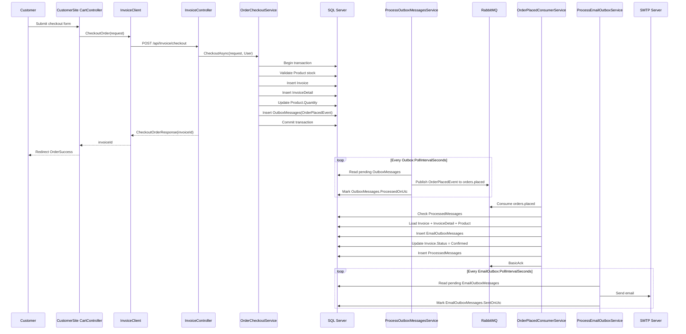

# RabbitMQ Order Workflow

Tài liệu này mô tả luồng từ lúc customer đặt hàng đến khi email xác nhận được gửi, bao gồm trigger, hàm được gọi, bảng bị ảnh hưởng và retry behavior.

## Tổng Quan

Luồng hiện tại dùng các pattern chính:

- Transactional Outbox: checkout ghi `OutboxMessages` trong cùng transaction tạo order, sau đó worker publish RabbitMQ.
- Inbox/Idempotency: consumer ghi `ProcessedMessages` để không xử lý trùng message.
- Email Outbox: consumer không gửi email trực tiếp, mà ghi `EmailOutboxMessages`; email worker gửi sau. Nếu SMTP chưa cấu hình, email vẫn nằm pending trong DB.
- Dead-letter queue: nếu consumer xử lý lỗi, RabbitMQ đẩy message sang dead-letter queue.

## Sequence



## Trigger Timeline

| Step | Trigger | Default timing | Entry point | Notes |
| --- | --- | --- | --- | --- |
| Customer checkout | User submits checkout form | Immediate | `CustomerSite.Controllers.CartController.CheckOut(...)` | MVC builds checkout request from current cart. |
| API checkout | HTTP POST from CustomerSite | Immediate | `BackendAPI.Controllers.InvoiceController.Checkout(...)` | Requires JWT via `[Authorize]`. |
| Order transaction | API calls order service | Immediate | `OrderCheckoutService.CheckoutAsync(...)` | Creates order and outbox message in one DB transaction. |
| Outbox worker starts | `BackendAPI` app starts | On application startup | `ProcessOutboxMessagesService.ExecuteAsync(...)` | Registered by `AddHostedService`. |
| Outbox polling | Background loop | Every `Outbox:PollIntervalSeconds`, default `5` seconds | `ProcessOutboxMessagesService.ProcessBatchAsync(...)` | Checkout does not call this directly. It polls DB after checkout commits. |
| RabbitMQ publish | Outbox worker finds pending message | On next outbox poll | `RabbitMqOrderEventPublisher.PublishOrderPlacedAsync(...)` | Publishes persistent message to `orders.placed`. |
| RabbitMQ consumer starts | `BackendAPI` app starts | On application startup | `OrderPlacedConsumerService.ExecuteAsync(...)` | Connects to RabbitMQ and waits for messages. Reconnect delay is `15` seconds if broker is unavailable. |
| RabbitMQ consume | Message arrives in queue | Event-driven | `OrderPlacedConsumerService.HandleMessageAsync(...)` | Uses `ProcessedMessages` to skip duplicates. |
| Email outbox worker starts | `BackendAPI` app starts | On application startup | `ProcessEmailOutboxService.ExecuteAsync(...)` | Registered by `AddHostedService`. |
| Email outbox polling | Background loop | Every `EmailOutbox:PollIntervalSeconds`, default `10` seconds | `ProcessEmailOutboxService.ProcessBatchAsync(...)` | If SMTP host is empty, messages remain pending. |
| SMTP send | Email worker finds pending email | On next email poll after SMTP is configured | `SmtpEmailSender.SendEmailAsync(...)` | Marks `SentOnUtc` when successful. |

## Step Details

### 1. Customer Submit Checkout

Code:

- `BackendAPI/CustomerSite/Controllers/CartController.cs`
- Method: `CheckOut([FromForm] string fullName, [FromForm] string shippingAddress, [FromForm] string phone, [FromForm] string email)`

What happens:

- Reads current cart.
- Validates cart is not empty.
- Validates product is still available.
- Builds `CheckoutOrderRequestDTO`.
- Calls `invoiceClient.CheckoutOrder(checkoutRequest)`.

Tables affected:

- None directly in `CustomerSite`.

### 2. CustomerSite Calls Backend API

Code:

- `BackendAPI/CustomerSite/Clients/InvoiceClient.cs`
- Method: `CheckoutOrder(CheckoutOrderRequestDTO checkoutOrderRequest)`

What happens:

- Sends `POST /api/Invoice/checkout`.
- Uses JWT from cookie through `BaseClient`.
- Throws error if API returns non-success.

Tables affected:

- None directly in `CustomerSite`.

### 3. API Receives Checkout

Code:

- `BackendAPI/BackendAPI/Controllers/InvoiceController.cs`
- Method: `Checkout(...)`

What happens:

- Requires authenticated customer.
- Delegates to `OrderCheckoutService.CheckoutAsync(...)`.
- Returns `CheckoutOrderResponseDTO` with `InvoiceId`, `Status`, `Total`.

Tables affected:

- None directly in controller.

### 4. Create Order And Outbox Message

Code:

- `BackendAPI/BackendAPI/Services/Orders/OrderCheckoutService.cs`
- Method: `CheckoutAsync(...)`

What happens inside one DB transaction:

- Gets authenticated customer id from JWT.
- Normalizes cart items by `ProductId`.
- Loads products.
- Checks product exists, enabled, has price, and has enough stock.
- Decreases `Product.Quantity`.
- Inserts `Invoice` with status `InvoiceStatus.Pending`.
- Inserts `InvoiceDetail`.
- Inserts `OutboxMessages` with serialized `OrderPlacedEvent`.
- Commits transaction.

Tables affected:

- `Product`: update `Quantity`.
- `Invoice`: insert new invoice/order.
- `InvoiceDetail`: insert order line items.
- `OutboxMessages`: insert pending integration event.

Important behavior:

- RabbitMQ is not called inside checkout request.
- If DB transaction fails, order and outbox message both roll back.
- If RabbitMQ is down, checkout can still succeed because the message is durable in DB.

### 5. Process Outbox Messages

Code:

- `BackendAPI/BackendAPI/Services/Messaging/ProcessOutboxMessagesService.cs`
- Methods: `ExecuteAsync(...)`, `ProcessBatchAsync(...)`

Trigger:

- Starts when `BackendAPI` starts.
- Polls every `Outbox:PollIntervalSeconds`, default `5` seconds.
- Reads at most `Outbox:BatchSize`, default `20` messages per loop.

What happens:

- Reads `OutboxMessages` where:
  - `ProcessedOnUtc == null`
  - `RetryCount < Outbox:MaxRetryCount`
  - `NextAttemptOnUtc == null || NextAttemptOnUtc <= now`
- Deserializes `OrderPlacedEvent`.
- Calls `IOrderEventPublisher.PublishOrderPlacedAsync(...)`.
- If publish succeeds, sets `ProcessedOnUtc`.
- If publish fails, increments `RetryCount`, sets `LastAttemptOnUtc`, `NextAttemptOnUtc`, and `Error`.

Tables affected:

- `OutboxMessages`: update processed/retry fields.

Retry behavior:

- Backoff is exponential: `2^RetryCount` seconds.
- Delay is capped at `300` seconds.
- Stops retrying after `Outbox:MaxRetryCount`, default `10`.

### 6. Publish RabbitMQ Message

Code:

- `BackendAPI/BackendAPI/Services/Messaging/RabbitMqOrderEventPublisher.cs`
- Method: `PublishOrderPlacedAsync(OrderPlacedEvent orderPlaced, CancellationToken cancellationToken)`

What happens:

- Declares RabbitMQ topology:
  - Queue: `orders.placed`
  - Dead-letter exchange: `orders.dead-letter`
  - Dead-letter queue: `orders.placed.dead-letter`
- Publishes `OrderPlacedEvent`.
- Message properties:
  - `ContentType = application/json`
  - `MessageId = CorrelationId`
  - `CorrelationId = CorrelationId`
  - `Persistent = true`
  - `Type = OrderPlacedEvent`

RabbitMQ affected:

- Publishes to queue `orders.placed`.

Operational note:

- If a local RabbitMQ queue `orders.placed` already existed before dead-letter config was added, delete/recreate that queue so RabbitMQ accepts the new queue arguments.

### 7. Consume OrderPlacedEvent

Code:

- `BackendAPI/BackendAPI/Services/Messaging/OrderPlacedConsumerService.cs`
- Methods: `ExecuteAsync(...)`, `ConsumeAsync(...)`, `HandleMessageAsync(...)`

Trigger:

- Starts when `BackendAPI` starts.
- Waits for RabbitMQ messages in `orders.placed`.
- If RabbitMQ connection fails, retries connection after `15` seconds.

What happens:

- Declares the same queue/dead-letter topology.
- Sets `BasicQos(0, 1, false)` to process one message at a time per consumer.
- On message received:
  - Reads `MessageId` from RabbitMQ properties, fallback to event `CorrelationId`.
  - Checks `ProcessedMessages`.
  - If message already processed, acknowledges and stops.
  - Loads `Invoice` with `InvoiceDetail` and `Product`.
  - If invoice is `Pending`, creates `EmailOutboxMessages`.
  - Updates `Invoice.Status = Confirmed`.
  - Inserts `ProcessedMessages`.
  - Commits DB transaction.
  - Sends `BasicAck`.

Tables affected:

- `ProcessedMessages`: insert message id and consumer name.
- `Invoice`: update `Status` from `Pending` to `Confirmed`.
- `EmailOutboxMessages`: insert pending email to send.

Failure behavior:

- If handling throws, consumer calls `BasicNack(requeue: false)`.
- RabbitMQ moves message to `orders.placed.dead-letter`.
- Because `ProcessedMessages` is written in DB, duplicate deliveries after successful DB commit are skipped.

### 8. Process Email Outbox

Code:

- `BackendAPI/BackendAPI/Services/Email/ProcessEmailOutboxService.cs`
- Methods: `ExecuteAsync(...)`, `ProcessBatchAsync(...)`

Trigger:

- Starts when `BackendAPI` starts.
- Polls every `EmailOutbox:PollIntervalSeconds`, default `10` seconds.

What happens:

- If `SmtpEmail:Host` is empty:
  - Logs that SMTP is not configured.
  - Leaves `EmailOutboxMessages` pending.
- If SMTP is configured:
  - Reads pending `EmailOutboxMessages`.
  - Sends email via `IEmailSender.SendEmailAsync(...)`.
  - Marks `SentOnUtc` when successful.
  - Updates retry fields when failed.

Tables affected:

- `EmailOutboxMessages`: update `SentOnUtc`, `RetryCount`, `LastAttemptOnUtc`, `NextAttemptOnUtc`, `Error`.

Retry behavior:

- Backoff is exponential: `2^RetryCount` seconds.
- Delay is capped at `300` seconds.
- Stops retrying after `EmailOutbox:MaxRetryCount`, default `10`.

### 9. Send SMTP Email

Code:

- `BackendAPI/BackendAPI/Services/Email/SmtpEmailSender.cs`
- Method: `SendEmailAsync(...)`

What happens:

- Sends email with configured SMTP settings.
- Throws if `SmtpEmail:Host` is empty.

External system affected:

- SMTP server.

## Tables

| Table | Role | Written by | Read by |
| --- | --- | --- | --- |
| `Product` | Stock source | `OrderCheckoutService` updates quantity | `OrderCheckoutService`, `OrderPlacedConsumerService` |
| `Invoice` | Order header | `OrderCheckoutService` inserts, `OrderPlacedConsumerService` updates status | `OrderPlacedConsumerService` |
| `InvoiceDetail` | Order line items | `OrderCheckoutService` inserts | `OrderPlacedConsumerService` |
| `OutboxMessages` | Durable integration event queue in DB | `OrderCheckoutService` inserts, `ProcessOutboxMessagesService` updates | `ProcessOutboxMessagesService` |
| `ProcessedMessages` | Idempotency/inbox table | `OrderPlacedConsumerService` inserts | `OrderPlacedConsumerService` |
| `EmailOutboxMessages` | Durable email queue in DB | `OrderPlacedConsumerService` inserts, `ProcessEmailOutboxService` updates | `ProcessEmailOutboxService` |

## Configuration

Configured in `BackendAPI/BackendAPI/appsettings.json`.

```json
{
  "RabbitMq": {
    "Enabled": true,
    "HostName": "localhost",
    "Port": 5672,
    "UserName": "guest",
    "Password": "guest",
    "VirtualHost": "/",
    "OrderPlacedQueue": "orders.placed",
    "DeadLetterExchange": "orders.dead-letter",
    "DeadLetterQueue": "orders.placed.dead-letter"
  },
  "Outbox": {
    "Enabled": true,
    "PollIntervalSeconds": 5,
    "BatchSize": 20,
    "MaxRetryCount": 10
  },
  "SmtpEmail": {
    "Host": "",
    "Port": 587,
    "EnableSsl": true,
    "UserName": "",
    "Password": "",
    "From": "noreply@laptopstore.local",
    "FromName": "Laptop Store"
  },
  "EmailOutbox": {
    "Enabled": true,
    "PollIntervalSeconds": 10,
    "BatchSize": 20,
    "MaxRetryCount": 10
  }
}
```

## Required Migration

The outbox/inbox tables are created by:

```text
BackendAPI/BackendAPI.Persistence/Migrations/20260616085636_AddRabbitMqOutboxInbox.cs
```

Apply DB migration:

```powershell
dotnet ef database update --project BackendAPI\BackendAPI.Persistence\BackendAPI.Persistence.csproj --startup-project BackendAPI\BackendAPI\BackendAPI.csproj
```

## Failure Scenarios

| Scenario | Result |
| --- | --- |
| RabbitMQ is down during checkout | Checkout still creates order and `OutboxMessages`; outbox worker retries later. |
| RabbitMQ publish fails | `OutboxMessages.RetryCount`, `NextAttemptOnUtc`, and `Error` are updated. |
| Consumer receives duplicate RabbitMQ message | `ProcessedMessages` causes duplicate to be skipped. |
| Consumer fails while processing | Message is nacked with `requeue: false` and moves to dead-letter queue. |
| SMTP is not configured | `EmailOutboxMessages` stays pending. No email is lost. |
| SMTP send fails | `EmailOutboxMessages` retry fields are updated and worker retries later. |

## Current Status Values

Defined in `BackendAPI/ShareView/Constants/InvoiceStatus.cs`.

| Value | Meaning |
| --- | --- |
| `1` | Pending |
| `2` | Confirmed |
| `3` | Failed |
| `4` | Cancelled |
